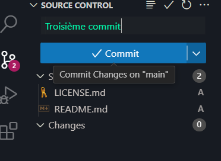
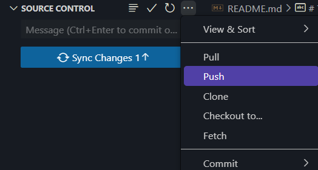

# Travail Pratique 2
Ce dépôt contient le code d’un projet web fait dans le cours de Perspective Professionnelles.
## Faire un commit et un push dans Visual Studio Code
Voici comment faire un changement sur ce projet, et l’envoyer sur GitHub.
1. Ouvrez le Source Control sur le coté gauche de l'écran ou appuyer sur Ctrl+Shift+G.
2. Cliquez sur l'icône « + » à côté de chaque fichier modifié pour organiser les fichiers individuellement, ou cliquez sur l'icône « Stage All Changes » en haut pour organiser toutes les modifications.
3. Entrez un message commit dans l'espace fait pour cela et appuyer sur enter pour faire un commit.
4. Cliquez sur le bouton « … » en haut du panneau de contrôle de source, puis sélectionnez « Push » dans le menu déroulant.
Si vous effectuez un transfert vers une nouvelle branche, sélectionnez « Pousser vers » et entrez le nom de la branche.
 
 
 

 ## Contributeurs
 * [Ryan Blanchette](https://github.com/Sau6sse) - Auteur principal

## License 
Copyright @ 2024 Ryan Blanchette. Tous droits réservés.